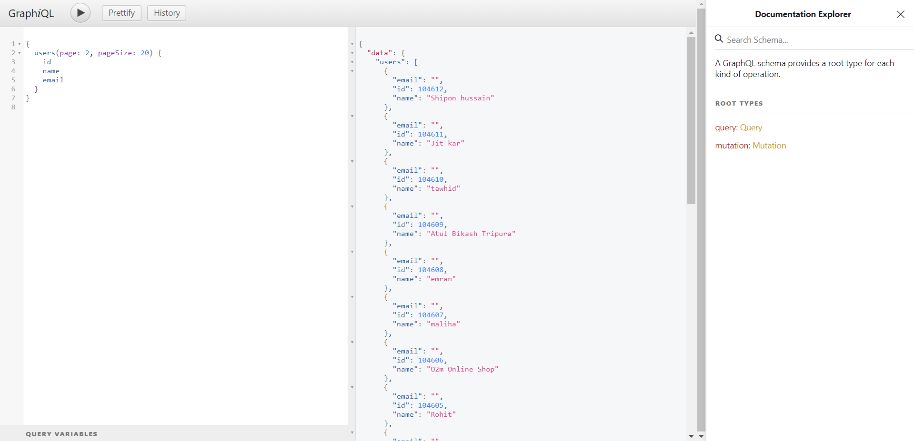

# goalng-microservices

# <h5> You can start the project with below commands </h5>

```bash
	go run main.go
```

# <h5> go to database/database.go and set up database configure </h5>

```bash
	DB_HOST := "localhost"
	DB_PORT := "3306"
	DB_NAME := "go_crud"
	DB_PASS := "123"
	DB_USER := "root"
```

# <h5> Check in queries for users </h5>

```bash
	{
		users(page: 2, pageSize: 20) {
			id
			name
			email
		}
	}

```

# screenshot 

